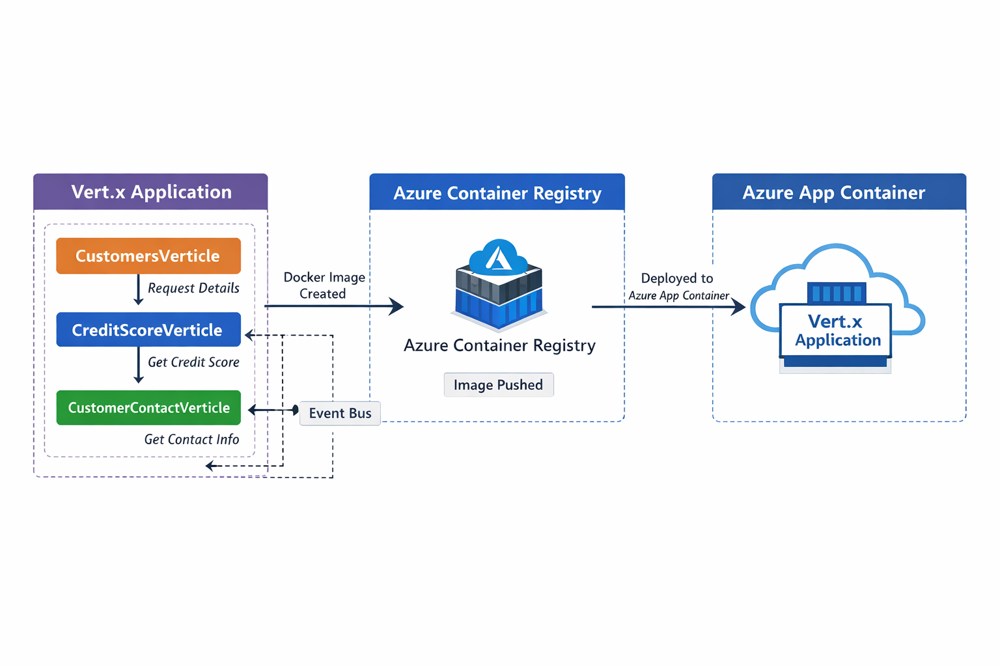

Task: Implement Customer Credit Score application using vert.x application with verticles in java, groovy  

This application has the following verticles.  
Customers Verticle: To retrieve from 3 different verticles and consolidate the response  
CosmosDBVerticle: To retrieve credit score from CosmosDB  
CreditScore Verticle: To retrieve credit score of a customer 
CustomerContactsVerticle: To retrieve the address details 
Employment Verticle: Retrieve the employment details of a customer 

This application retrieves customer credit score from Azure Cosmos DB and also used Circuit Breaker pattern to fallback.  
This application is deployed as an Azure Container App.  
Steps to Deploy: 
1. mvn clean install
2. create a docker image  
   docker build --platform linux/amd64 -t vertx_test .  
3. Login to Azure  
   az acr login --name vertxcontainerregistry  
4. Tag the docker image  
   docker tag vertx_test vertxcontainerregistry.azurecr.io/vertx_test  
5. Push the docker image to ACR  
   docker push vertxcontainerregistry.azurecr.io/vertx_test  
6. In Azure create container instance
